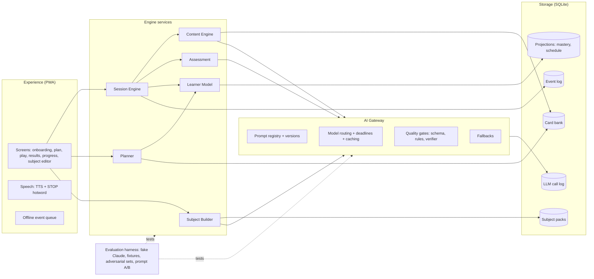

# Foundation: a subject-agnostic learning engine

*Design draft, October 2026. Builds on [`../research/`](../research/). This folder defines the engine before any subject is chosen. Subjects come later, as pilots that prove the engine works and produce data.*

| Doc | What it defines |
|---|---|
| [`system-architecture.md`](system-architecture.md) | Components, boundaries, the AI gateway, storage, governance rules |
| [`user-flow.md`](user-flow.md) | Every screen and path a learner takes, from first launch to daily use |
| [`ai-flow.md`](ai-flow.md) | Every AI pipeline: inputs, outputs, quality gates, fallbacks, models |
| [`data-and-evidence.md`](data-and-evidence.md) | Event model, data model, metrics, and how we prove learning happens |
| [`decisions.md`](decisions.md) | Architecture decisions already made, and the open questions |

## The one idea

**Any subject can be turned into the same game.** The game: watch someone work, catch their mistakes, explain why, learn what happens if you miss them.

The engine never knows what a "receptacle", a "change control board" or an "idempotency key" is. It knows only generic things:

| Engine concept | What it is | Trades example | Project-management example |
|---|---|---|---|
| **Subject** | A versioned pack describing one thing to learn | "Residential electrical basics" | "Running projects" |
| **Competency** | A skill or concept inside a subject | Verifying a circuit is dead | Handling change requests |
| **Mistake type** | A specific, plausible way people get a competency wrong | Trusting the breaker label | Starting work before approval |
| **Severity** | What a mistake costs *in this subject* | Injury | Failed audit |
| **Persona and setting** | Who is working and where | First-year apprentice, a kitchen | Junior PM, a warehouse rollout |
| **Card** | One unit of play: lesson, guided run, stop, next move, review, probe | | |

The engine personalizes, schedules, grades and measures. A **Subject Builder** (an AI pipeline with you in the loop) turns a goal like *"I want to understand how databases scale"* into a subject pack. Hand-authored packs, such as today's trades scenarios, use exactly the same format.

## Design principles

These come from the research and apply to every component.

1. **Subject-agnostic core.** No subject words in engine code or engine prompts. Everything subject-specific lives in the pack.
2. **Learn → stop → choose → review.** Every competency follows the ladder in [`user-flow.md`](user-flow.md#the-competency-ladder). Beginners are never dropped into hidden-mistake scenarios.
3. **The learner does the thinking.** The AI plays the apprentice, the examiner and the coach. It is never an on-demand answer key.
4. **Every AI output is checked, labelled and traceable.**
   - **Checked:** schema plus rules, plus a blind second pass for generated content.
   - **Labelled:** live, cached or fallback.
   - **Traceable:** stamped with prompt version and model.
   - **Correctable:** the learner can flag it.
5. **Degrade, never stall.** Every AI call has a deadline and a non-AI fallback. This carries over from the hackathon hardening.
6. **Event-sourced truth.** What the learner did is stored as an append-only event log. Mastery, schedules and dashboards are derived from it and can be recomputed when a formula changes.
7. **Measure learning, not just engagement.** Delayed probes on trained versus held-out mistake types are built in from day one. See [`data-and-evidence.md`](data-and-evidence.md).
8. **Designed for focus.** 3–6 minute sessions, a decision every 30–40 seconds, resume anywhere, a daily plan instead of a menu, and weekly goals instead of punishing streaks.

## System at a glance

## Proving it works

The plan is to build the foundation first, then pilot it on two subjects chosen for what they let us measure, not for the expertise involved:

| Pilot | Why |
|---|---|
| **A subject you can judge** (you can tell when the content is wrong) | Measures **content quality**: defect rate, verifier accuracy, grader agreement |
| **A subject that's new to you** | Measures **learning**: delayed-probe gains on trained versus held-out mistake types |

What counts as success is defined in [`data-and-evidence.md`](data-and-evidence.md#success-criteria-for-the-pilots).

## What exists today vs. what's new

| Already built (hackathon + hardening) | New in the foundation |
|---|---|
| Narration, STOP, explain, grade, consequences | Subject Builder and subject packs |
| Contract, schemas, validator | Card types beyond "stop" |
| Claude calls with deadlines, refusal handling, fallbacks | Learner model, planner, review queue |
| Keyword fallback grader | Event log and SQLite persistence |
| Fake-Claude test harness, 97 tests | Prompt registry and versioning |
| Scoring simulator | Verifier pass; probes and evidence metrics |
| | Subject-agnostic prompts and UI copy |

## Research behind this design

Sources added in this round (the earlier ones are in [`../research/`](../research/)):
- **LLM knowledge-component extraction.** LLMs match experts at identifying concepts but struggle with prerequisite links, which need human correction:
  - [Adaptive learning-curve analytics with LLM KC identifiers (Aalto, UKICER '25)](https://research.aalto.fi/fi/publications/adaptive-learning-curve-analytics-with-llm-kc-identifiers-for-kno/)
  - [ASEE: problem generation with knowledge components](https://peer.asee.org/problem-generation-to-personalized-tutoring-leveraging-generative-ai-and-knowledge-components-in-engineering-education.pdf)
  - [Curriculum knowledge graphs from syllabi (AGH)](https://badap.agh.edu.pl/publikacja/162874)
  - [AI-assisted educational knowledge graphs (Sabancı)](https://research.sabanciuniv.edu/id/eprint/51711/)
  - [Knowledge gaps via prerequisite graphs](https://arxiv.org/pdf/2606.10736)
- **LLM grading reliability.** Agreement varies from near-perfect to none. It is strongest for binary judgments, degrades as rubrics get finer, and improves when low-confidence cases are deferred:
  - [LLM-as-a-Grader (Emory, 2025)](https://arxiv.org/html/2511.10819v2)
  - [Medical short-answer grading (2025)](https://arxiv.org/abs/2505.04645v1)
  - [Rubric-conditioned grading and deferral](https://arxiv.org/html/2601.08843v1)
  - [Grading-scale effects](https://arxiv.org/pdf/2601.03444v1)
- **LLM-generated mistakes and distractors.** They are plausible, but they don't reliably match the errors real learners make:
  - [Do LLMs make mistakes like students?](https://arxiv.org/html/2502.15140v1)
  - [Distractors for code completion (FLAIRS 2025)](https://par.nsf.gov/biblio/10613658-generating-distractors-code-completion-problems-can-llm-assist-instructors)
  - [Math MCQ distractors](https://arxiv.org/pdf/2404.02124v2)
  - [MISTAKE (2025)](https://huggingface.co/papers/2510.11502)
- **Spaced repetition:**
  - [open-spaced-repetition (FSRS, ts-fsrs)](https://github.com/open-spaced-repetition)
  - [srs-benchmark](https://www.libhunt.com/r/srs-benchmark)
  - [SuperMemo's dispute of the benchmark](https://www.supermemo.com/en?p=147652)
- **Event model:**
  - [xAPI concepts (Open edX Aspects)](https://docs.openedx.org/projects/openedx-aspects/en/open-release-redwood.master/concepts/xapi_concepts.html)
  - [xAPI overview](https://edutechwiki.unige.ch/en/XAPI)
- **Single-case evaluation:**
  - [Bishop, *Evaluating What Works*: single-case designs](https://bookdown.org/dorothy_bishop/Evaluating-What-Works/Single.html)
  - [Digital-health N-of-1 primer](https://arxiv.org/pdf/2608.15526)
