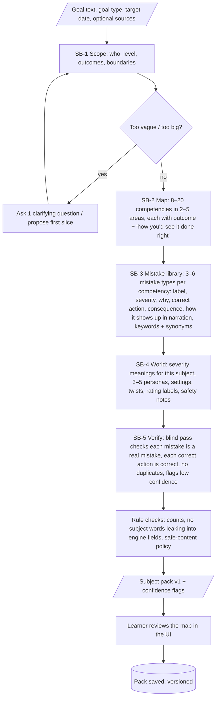
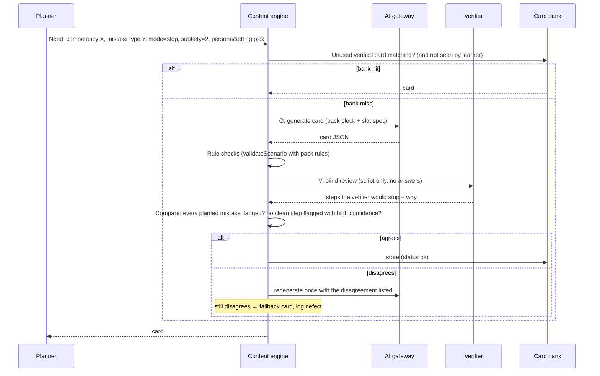
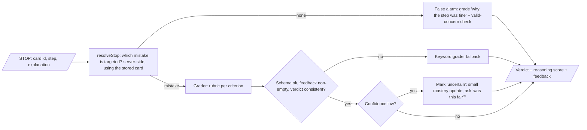

# AI flow

Every place the engine calls Claude: inputs, outputs, quality gates, fallbacks and model choice. All calls go through one **AI Gateway** (today's `server/llm.js`, extended).

## 1. Gateway rules (apply to every pipeline)

| Rule | How |
|---|---|
| Structured output only | Every call has a JSON schema (`output_config.format`). No free-text parsing. |
| Hard deadline per call kind | `AbortSignal.timeout` and `maxRetries: 1`, including retry-after waits. This is the existing BRAIN-02 behavior. |
| Stamped and logged | Each output carries `{promptId, promptVersion, model, latencyMs, tokens, cost}` and is written to the `llm_call` table. |
| Prompt registry | Prompts live in `server/prompts/<id>.js` with an exported `VERSION`. Changing the text bumps the version, so data from different versions is never silently mixed. A "text change" is any change to the prompt fingerprint (system text, schema, rendered user template); see [ADR 0005](../adr/0005-ai-gateway-and-prompt-registry.md). |
| Untrusted input stays fenced | Learner text, uploaded sources and pack text inside prompts are wrapped in tags and stated to be data, never instructions. This extends the grade prompt's `<learner_explanation>` pattern. |
| Model routing | A per-pipeline default (table below), overridable by env, for A/B testing. |
| Caching | The stable prefix comes first (system prompt, then pack block, then the scenario script) with `cache_control`. Only the varying parts follow. |
| Fallback chain | Every learner-facing pipeline has a non-AI fallback (table below). |

## 2. Pipelines

| ID | Pipeline | When it runs | Latency budget | Default model* | Fallback |
|---|---|---|---|---|---|
| SB | **Subject Builder** | Onboarding and map edits | 60 s, streamed progress | Opus 5.5 | Ask the learner to narrow the scope; offer starter templates |
| L | **Lesson writer** | New competency | Pre-generated | Sonnet 5.5 | Generic "learn the move" built from the mistake-type text |
| G | **Card generator** (guided, stop, next-move, probe) | Nightly bank fill, or on demand | 40 s on demand; batch overnight | Opus 5.5 | Banked card, then a pack fixture |
| V | **Verifier** (blind expert pass) | After every G and SB output | Batch / 20 s | Sonnet 5.5 | Card held out of the bank |
| A | **Grader** | Each STOP | **8 s** | Opus 5.5, low effort (A/B Haiku 5.5) | Keyword grader on the server only; never in the browser ([ADR 0004](../adr/0004-no-grading-in-the-browser.md)) |
| C | **Coach line** (insight sentence on Today) | Daily | Batch | Haiku 5.5 | A template sentence |
| M | **Mistake miner** | Weekly, over your wrong explanations and flags | Batch | Sonnet 5.5 | — |

\*Model choices are starting points to measure, not conclusions. The research workstream estimated $0.09–0.27 per scenario depending on routing.

## 3. Subject Builder

The research shaped this pipeline in three ways:
- LLMs **identify concepts well** (matching experts in an intro-programming replication).
- They extract **prerequisite links poorly**, so those links need human correction.
- They **don't reliably predict real learners' mistakes.**

So the builder keeps prerequisites shallow, marks uncertainty, verifies, and lets your own mistakes reshape the map over time (the M pipeline).



**Output.** The output is a **subject pack**, in the same format hand-authored packs use:
```jsonc
{
  "id": "db-scaling", "version": 1, "title": "How databases scale",
  "goal": { "type": "understand", "targetDate": null, "level": "intermediate" },
  "severity": { "critical": "data loss or outage", "major": "slow or costly system", "minor": "maintainability debt" },
  "personas": [{ "name": "Kai", "role": "backend engineer, 1 year in", "style": "confident, moves fast" }],
  "settings": ["a startup preparing for a launch spike", "an e-commerce site's checkout database"],
  "twists": ["traffic doubled overnight", "the senior engineer is on vacation"],
  "areas": [{ "id": "replication", "label": "Replication" }],
  "competencies": [{
    "id": "read-replicas", "area": "replication", "label": "Using read replicas",
    "outcome": "Knows when reads can go to replicas and the lag trade-off",
    "prereqs": [], "prereqConfidence": "low",
    "mistakeTypes": [{
      "id": "read-after-write-on-replica", "label": "Reading your own write from a lagging replica",
      "severity": "major", "why": "...", "correctAction": "...", "consequence": "...",
      "showsUpAs": "routes the confirmation page read to a replica right after the write",
      "keywords": ["lag", "stale", "replica", "primary", "read your writes", "consistency"],
      "confidence": "high", "source": "general knowledge"
    }]
  }],
  "ratings": { "missedCritical": "The site went down", "tiers": ["Senior instincts", "Solid", "Keep watching", "Back to basics"] },
  "safety": { "regulated": false, "disclaimer": null },
  "provenance": { "builtBy": "subject-builder", "promptVersion": "sb@3", "model": "claude-opus-5-5" }
}
```

## 4. Card generation and verification



**The slot spec.** The planner, not the model, decides *what* to practise. The model only decides *how to tell it*:
- the competency, the mistake types to plant (0–3), their subtlety, and positions within the allowed range;
- the persona, setting and twist (chosen at random so jobs vary, since the model takes no sampling parameters);
- the mode: guided, stop, next-move, or probe;
- for **zero-mistake runs**, an explicit "all steps correct, include 2 casual-sounding but correct steps".

**Rule checks** (the existing `validateScenario`, made pack-aware):
- step count and line length;
- placement rules (no mistake in the first 2 steps or the last step, at least one clean step between mistakes);
- every planted mistake maps to the requested `mistakeTypeId`;
- keywords are not copied from the narration line;
- the safe-content policy for regulated subjects.

**The blind verifier.** It gets the script with no answers and the pack's competency block, and is asked: "As an expert, which steps would you stop, and why?" It must flag every planted mistake and must not flag a clean step with high confidence. This catches the worst defect: a "correct" step that's actually wrong.

## 5. Grading



**Rubric.** The research shows LLM-human agreement is strong for binary judgments and degrades as rubrics get finer, so each criterion stays coarse:

| Criterion | Scale | Question |
|---|---|---|
| **Identified** | yes / partly / no | Did they name the actual problem? |
| **Why** | 0 / 1 / 2 | Did they say what it breaks or what it causes? |
| **Fix** | 0 / 1 / 2 | Did they say what should happen instead? (Optional in early stages.) |

These map onto today's contract:
- `verdict` comes from *Identified*;
- `reasoningScore = (Why + Fix) / 4`.

The grader also returns `confidence: high | low`. Low-confidence grades are deferred: they get a smaller mastery update and trigger a fairness spot-check. This follows the consensus-deferral approach in the grading research.

**Keyword fallback.** Keywords come from the mistake type, and synonyms come from the pack. Neither is hardcoded per subject.

## 6. Mistake miner (the loop that makes it personal)

Each week it reads your wrong-reason explanations, your false alarms with "valid concern" notes, and your flags, and proposes:
- **new mistake types** you actually hold, such as "you think replicas are always consistent";
- **fixes** to flagged cards or mistake types;
- **merges** of duplicate mistake types.

Proposals appear as a "suggested map changes" list that you accept or reject. Over time the pack shifts from "mistakes an AI imagines" toward **mistakes you actually make**. That is the research's main gap in AI-generated distractors, and it becomes the app's main source of advantage.

## 7. Safety and content policy

These apply in every pipeline:
- **Regulated subjects** (health, legal, electrical, finance) get a disclaimer and "practice, not advice" framing. Critical mistakes teach recognition and the safe alternative, never dangerous procedural detail.
- **No impersonation** of real certification bodies, and no "real exam questions".
- **No verbatim reproduction** of copyrighted texts. Uploaded sources are quoted only in short cited snippets.
- **Refusals** from the model fall back gracefully and are logged by category. The pack can be narrowed if refusals repeat.
