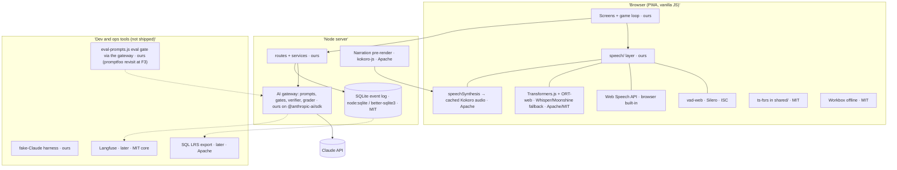

# Open-source landscape: what to reuse instead of rebuilding

*October 2026.*

**How this was checked.** Licenses and last-release dates for JavaScript and Python packages come straight from the **npm and PyPI registries** (marked ✅). Facts about projects that aren't packages come from search results and are marked 🔎. GitHub's API was not reachable from this session, so check the LICENSE file of any 🔎 project before copying code from it.

## Summary

- **Nobody ships our core loop.** No open-source project has "an AI apprentice narrates, makes planted mistakes, and you stop and explain". The full public version of this check is in [`../research/market.md`](../research/market.md). So the parts that make the product different stay ours, and they're small:
  - the Subject Builder and card prompts;
  - the blind verifier;
  - the rubric grader;
  - the game rules and scoring;
  - the evidence experiment.
- **Almost everything around the core loop already exists** under permissive licenses: spaced repetition, voice detection, in-browser speech recognition and synthesis, prompt evaluation, LLM tracing, the learning-record format and offline support. We assemble those parts.
- **Several full products are worth studying, not adopting.** OATutor, DeepTutor, Oppia and Open Notebook solve neighboring problems. They're heavy (different stacks, servers, frameworks), but their designs answer questions we'd otherwise work out from scratch.

## License policy (decision D15)

| Allowed in our code | Allowed only as a separate service or tool (not linked into our code) | Avoid copying from |
|---|---|---|
| MIT, Apache-2.0, BSD, ISC | GPL/AGPL tools run as separate processes, e.g. a CLI | GPL-3/AGPL code into our codebase: Anki (AGPL 🔎), TutorGPT (GPL-3 🔎), Piper TTS (now GPL-3 🔎) |

**Model weights carry their own licenses**, separate from the code that runs them. Kokoro's weights are Apache-2.0 🔎. Check each model card.

## 1. Adopt: drop-in libraries

| Our need | Use | License | Activity | How it fits |
|---|---|---|---|---|
| Spaced repetition | **ts-fsrs** (`open-spaced-repetition`) | MIT ✅ | v5.4.2, published 2026-10-03 ✅ | **Use FSRS from day one** instead of building Leitner boxes. It's in TypeScript, so it runs in `shared/` in both browser and server. It also ships a parameter optimizer for later. The Python `fsrs` package is MIT too ✅, for offline analysis. |
| Detecting end of speech and gating the hotword | **@ricky0123/vad-web** (Silero VAD on ONNX Runtime Web) | ISC ✅ | v0.0.31, published 2026-09-12 ✅ | Replaces the "1.5 s of silence" heuristic with real voice-activity detection. Hotword matching runs only when speech is detected, which cuts false "stop"s. |
| Running models in the browser | **@huggingface/transformers** (Transformers.js) + **onnxruntime-web** | Apache-2.0 ✅ / MIT ✅ | v4.3.1, 2026-10-06 ✅ | One runtime for in-browser speech recognition and synthesis below |
| Speech recognition fallback (Safari, offline, privacy) | **Whisper** (base, about 200 MB, cached) or **Moonshine** small models via Transformers.js | Whisper MIT 🔎; `moonshine-voice` MIT ✅ (v0.1.5, 2026-08-24) | Active | Used when Web Speech is missing or you choose "on-device only". Run it in a Web Worker so the UI doesn't freeze 🔎. |
| Better narration voice | **Kokoro-82M** via **kokoro-js** | Apache-2.0 ✅ (package) / weights Apache 🔎 | kokoro-js last published 2025-05 ✅ (stale wrapper; the model itself is fine) | **Render each card's narration once** to audio and cache it, so replays cost nothing. Rendering can happen server-side in Node or in the browser. WebGPU works best in Chrome and Edge 🔎. **Don't use Piper**: its maintained version moved to GPL-3 in 2025 🔎. |
| Prompt evaluation gate in CI | **promptfoo**: *deferred to F3, not adopted in F1* ([ADR 0007](../adr/0007-plain-node-eval-runner.md)) | MIT ✅ | v0.124.1, 2026-10-08 ✅ (acquired by OpenAI in March 2026, which says it stays MIT 🔎) | **F1 uses a plain Node runner** (`scripts/eval-prompts.js`) that calls our AI gateway. promptfoo is 31.7 MB with 76 direct dependencies including telemetry, needs Node ≥22.22, and its Anthropic provider would bypass the gateway (inv. 3). **Revisit at F3** with the verifier and safety sets, only if it runs offline through a custom provider that calls our gateway, as an optional dev install. **Alternative:** Inspect AI (MIT ✅, Python, very active). |
| Offline and PWA support | **Workbox** | MIT ✅ | v7.4.1 ✅ | Caches the app shell, card bank, lessons and audio |
| SQLite | **better-sqlite3**, or the built-in `node:sqlite` | MIT ✅ | v13.0.3 ✅ | Behind `server/db.js`. Start with `node:sqlite` and switch if it misbehaves. |
| Branching scenarios *(later: rewind and replay, multi-path cases)* | **inkjs** (Inkle's ink runtime) | MIT ✅ | v2.4.0 ✅ | Only if we add real branching. Linear cards don't need it. |

## 2. Adopt later: services

| Our need | Use | License | Why later |
|---|---|---|---|
| LLM tracing, prompt versions, datasets, human annotation, LLM-as-judge | **Langfuse** (self-hosted or cloud) | Core MIT ✅ (SDK); the server's `/ee` folders are commercial 🔎; acquired by ClickHouse in January 2026 🔎 | It covers our `llm_call` log, prompt registry and grading-fairness annotations very well. But self-hosting needs Postgres, ClickHouse, Redis and S3 🔎, which is too much for one person on a laptop. **Start** with our SQLite `llm_call` table and `VERSION` constants. **Switch** when we have outside learners or want a dashboard, using the Langfuse cloud free tier or a self-hosted instance. |
| xAPI learning records for B2B or L&D buyers | **SQL LRS** (Yet Analytics) | Apache-2.0 🔎; supports SQLite and Postgres 🔎 | Our events are already xAPI-shaped (`data-and-evidence.md`). If a customer wants statements in their own Learning Record Store, export to SQL LRS. No redesign needed. |
| Real-time voice conversation *(reverse mode, live role-play)* | **Pipecat** or **LiveKit Agents** | BSD-2 ✅ / Apache-2.0 ✅; both active (2026-09/10 releases ✅) | Our core loop is turn-based (narrate, stop, explain), so browser speech is enough. These frameworks matter only when the AI must *converse* in real time with low latency. **Pipecat** suits our own transport; **LiveKit** suits WebRTC rooms 🔎. LiveKit's turn-detection models carry their own license 🔎. |
| Ingesting your own material (PDFs, pages, videos) | **Open Notebook**'s pipeline (it uses the `content-core` library) | MIT 🔎 | Phase 2 "your own sources". Reuse its extraction approach, possibly the `content-core` library directly (check its license). It's Python/SurrealDB, so adopt the library, not the app. |

## 3. Study, don't adopt: reference architectures

| Project | What it is | License | What to take | Why not adopt |
|---|---|---|---|---|
| **OATutor** (UC Berkeley CAHLR) | Open adaptive tutor with Bayesian Knowledge Tracing mastery, a built-in **A/B testing framework**, LTI, and content in JSON | MIT code, CC BY content 🔎 | (1) How its A/B framework assigns and logs conditions, which maps to our voice/text test and evidence arms. (2) Its JSON content schema for skills, problems and hints, as a sanity check for our pack format. (3) Mastery-gated progression, like our ladder. `pyBKT` (MIT ✅, v1.4.3, 2026-08) can analyze our data offline as a second opinion next to Elo. | React app built around math problem sets; not a narration game |
| **DeepTutor** (HKU Data Intelligence Lab) | An agent-based tutor: RAG over documents with citations, generated and **validated** practice questions, "Guided Learning" with a **mastery gate** and dashboard (v1.4+, 2026) | Apache-2.0 🔎 | (1) Its question generate-then-validate loop, compared against our blind verifier. (2) How it gates mastery in guided learning. (3) RAG with citations for Phase 2. It also has a published benchmark (TutorBench, arXiv 2604.26962 🔎), worth reading for evaluation ideas. | Python + Next.js, a chat-centric agent framework, and large. Our product is a game loop, not a chat. |
| **Oppia** | Interactive "explorations" that simulate a tutor conversation, with feedback per answer group | Apache-2.0 🔎 | Its model of answer groups mapping to targeted feedback is close to our mistake types mapping to "why" and "correct action". Worth reading for how they author feedback for misconceptions. | Python/Angular on Google App Engine; very heavy |
| **H5P Branching Scenario** | Authoring tool for branching cases with per-ending scoring | MIT 🔎 (`h5p-standalone` MIT ✅) | Patterns for scoring paths and endings, if we add branching cases | Hand-authored content tooling |
| **Anki** | The reference spaced-repetition app | AGPL 🔎 | Its scheduler is now FSRS, which we take via ts-fsrs | Copyleft; a flashcard paradigm |
| **TutorGPT** (Plastic Labs) | A tutor that models the learner's mental state ("theory of mind") | GPL-3.0 🔎 | The idea of a short "learner state" summary passed to prompts, similar to our Mistake Miner and coach line | GPL; read it, don't copy it |
| **pyKT** | Deep knowledge-tracing toolkit | ? (last release 2022 ✅) | — | Stale; overkill for one learner |
| **openWakeWord** | Open wake-word models (ONNX) | Apache-2.0 🔎 | A possible custom "stop" hotword running on-device through onnxruntime-web | Last PyPI release 2024-02 ✅. Its official web demo streams audio to a server 🔎. Treat as experimental and start with Web Speech matching. |

## 4. Assembled architecture

**What stays ours** (the differentiators, which together should be under about 3k lines):
- the game loop;
- Subject Builder prompts;
- card generation and blind verification;
- the rubric grader with deferral;
- the Mistake Miner;
- planner rules;
- Elo mastery;
- the evidence experiment;
- the speech-layer glue.

## 5. Changes to the foundation design

1. **FSRS from day one** via ts-fsrs. This drops the "Leitner first" step in `system-architecture.md` and `data-and-evidence.md`.
2. **Voice activity detection** with vad-web for end-of-speech and hotword gating (`voice-first.md`).
3. **Speech-recognition fallback** becomes "Web Speech, then on-device Whisper/Moonshine", replacing "server-side STT later". It's free and private.
4. **Narration pre-rendered** with Kokoro and cached. Feedback stays on live browser TTS.
5. ~~**promptfoo** implements the prompt eval gate.~~ **Amended by [ADR 0007](../adr/0007-plain-node-eval-runner.md):** in F1 the gate is a plain Node `scripts/eval-prompts.js` that calls the AI gateway, with a pure `evals/metrics.js` and recordings replayed in `npm test`. promptfoo is reconsidered at F3.
6. **Langfuse and SQL LRS** are planned integrations, not things we build.

## 6. Spikes to run before committing

Each is about half a day. Each one proves an integration works on *your* devices before we depend on it.

| Spike | Success if |
|---|---|
| vad-web + Web Speech "stop" on your laptop and phone | Barge-in under 400 ms; fewer than 1 false stop per 10 minutes of narration |
| Whisper or Moonshine on your phone's browser (Transformers.js) | Model loads and caches; 10 s of speech transcribed in under 3 s; usable accuracy on 10 sample explanations |
| Kokoro pre-render for a 10-step card | Under 20 s per card server-side; you prefer it to the browser voice |
| ts-fsrs scheduling through our event log | Deterministic schedule rebuilt from replaying events |
| `scripts/eval-prompts.js` on the grade prompt (fake Claude + one real-key run; the key is pending founder F-3) | Catches a deliberately broken prompt version |

## Sources

- **Registries** (checked 2026-10-08): npm (`ts-fsrs`, `@ricky0123/vad-web`, `kokoro-js`, `@huggingface/transformers`, `onnxruntime-web`, `inkjs`, `workbox-window`, `langfuse`, `promptfoo`, `better-sqlite3`, `h5p-standalone`, `@pipecat-ai/client-js`, `@livekit/agents`) and PyPI (`pipecat-ai`, `livekit-agents`, `pybkt`, `pykt-toolkit`, `openwakeword`, `inspect-ai`, `moonshine-voice`, `fsrs`).
- **OATutor:**
  - [neverworkintheory summary](https://neverworkintheory.org/2023/05/07/open-source-adaptive-tutoring-system.html)
  - [OATutor-Content](https://github.com/CAHLR/OATutor-Content)
  - [KTH tutorial](https://www.digitalfutures.kth.se/event/tutorial-introducing-an-open-source-adaptive-tutoring-system-to-accelerate-learning-sciences-experimentation/)
  - [pyBKT paper](https://arxiv.org/pdf/2105.00385)
- **Oppia:** [github.com/oppia/oppia](https://www.Github.com/oppia/oppia)
- **DeepTutor:**
  - [overview](https://emelia.io/hub/deeptutor-ai-learning-assistant)
  - [docs](https://www.mintlify.com/HKUDS/DeepTutor)
  - [paper](https://hyper.ai/fr/papers/2604.26962)
  - [directory](https://www.opensourcealternatives.to/item/deeptutor)
- **TutorGPT:** [listing](https://enterprisedna.co/directories/open-source/tutorgpt)
- **Pipecat and LiveKit:**
  - [Fora Soft comparison](https://www.forasoft.com/blog/article/pipecat-vs-livekit-agents)
  - [F22 Labs](https://www.f22labs.com/blogs/difference-between-livekit-vs-pipecat-voice-ai-platforms/)
  - [techsy ranking](https://techsy.io/en/blog/best-open-source-voice-agent-frameworks)
- **vad-web:** [ricky0123/vad](https://github.com/ricky0123/vad) · [browser guide](https://docs.vad.ricky0123.com/user-guide/browser/)
- **Wake words:**
  - [web-wake-word](https://cdn.jsdelivr.net/npm/web-wake-word@2.0.10/README.md)
  - [Howl (NLP-OSS 2020)](https://aclanthology.org/2020.nlposs-1.9)
- **Kokoro:** [kokoro-js](https://www.npmjs.com/package/kokoro-js) · [model card](https://huggingface.co/muratbuker/Kokoro-82M)
- **Piper's GPL change:** [PromptQuorum review](https://www.promptquorum.com/power-local-llm/piper-tts-review)
- **Whisper in the browser:**
  - [Whisper WebGPU demo](https://sagicc-webgpu-whisper-sr.static.hf.space)
  - [LogRocket](https://blog.logrocket.com/voice-ai-agent-browser/)
  - [2026 comparison](https://offlinetts.com/blog/browser-speech-recognition-whisper-comparison/)
- **Langfuse:**
  - [open source](https://langfuse.com/docs/open-source)
  - [license key](https://langfuse.com/self-hosting/license-key.md)
  - [handbook](https://langfuse.com/handbook/chapters/open-source)
  - [review](https://www.promptquorum.com/power-local-llm/langfuse-review)
- **promptfoo:** [Bloomberg](https://news.bgov.com/private-equity/openai-buying-ai-security-startup-promptfoo-to-safeguard-agents) · [Futurum](https://futurumgroup.com/?p=87434)
- **SQL LRS:** [yetanalytics/lrsql](https://github-redirect.dependabot.com/yetanalytics/lrsql) · [CB Insights](https://www.cbinsights.com/company/yet-analytics)
- **Learning Locker:** [docs](https://learninglocker.atlassian.net/wiki/spaces/DOCS/overview)
- **H5P:** [Cathy Moore](https://blog.cathy-moore.com/?p=19035) · [h5p.org](https://h5p.org/node/439819)
- **Open Notebook:** [KDnuggets](https://www.kdnuggets.com/open-notebook-a-true-open-source-private-notebooklm-alternative) · [ingestion analysis](https://instagit.com/lfnovo/open-notebook/describe-the-source-ingestion-workflow-stages-extract-embed-save)
- **FSRS:**
  - [open-spaced-repetition](https://github.com/open-spaced-repetition)
  - [srs-benchmark](https://www.libhunt.com/r/srs-benchmark)
  - [SuperMemo's critique](https://www.supermemo.com/en?p=147652)
