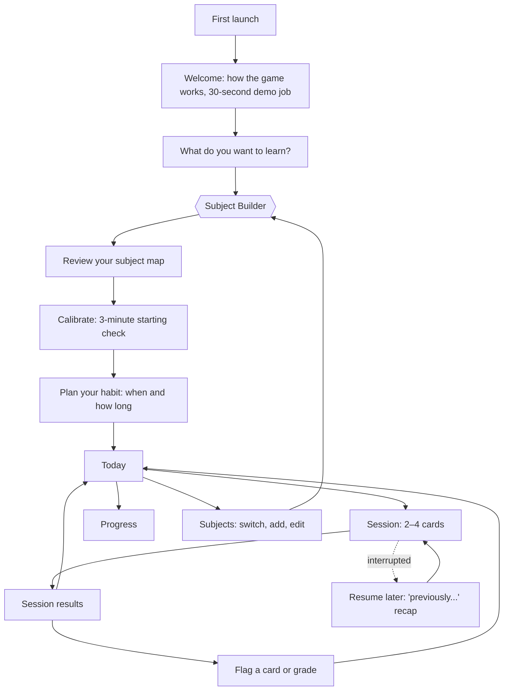
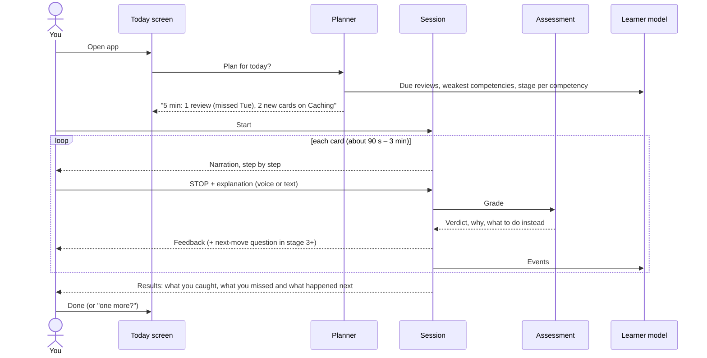
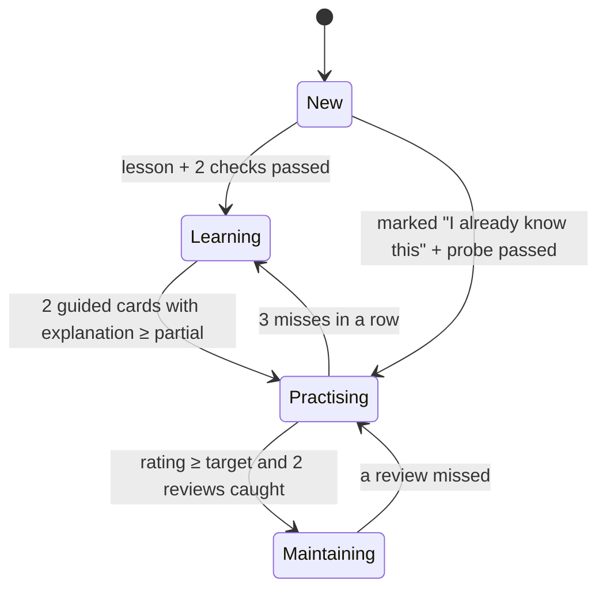

# User flow

Every path a learner takes, from first launch to daily use. Screen names are working titles.

## 1. Map of the app

## 2. First run (target about 6 minutes)

| Step | Screen | What happens | Why |
|---|---|---|---|
| 1 | **Welcome** | A 30-second sample job from a built-in demo pack (the trades scenario). You hit STOP once, explain, and see the grade and consequence. | Teaches the mechanic by doing it, not by explaining it. |
| 2 | **What do you want to learn?** | Free text ("how databases scale", "negotiation basics"), plus three optional inputs: a goal type (understand / pass a test / do my job better), a target date, and source material (paste or upload, Phase 2). | Gives the Subject Builder its inputs. The target date drives spacing. |
| 3 | **Building your subject** | Progress shown in plain words: "Mapping the main skills… Collecting common mistakes… Checking them…" (about 30–60 s, streamed). | AI pipeline SB-1 to SB-5. See [`ai-flow.md`](ai-flow.md#subject-builder). |
| 4 | **Review your subject map** | A list of 8–20 competencies grouped into areas, each showing 3–6 mistake types. You can rename, remove, reorder, or add "I already know this". Anything low-confidence is marked "AI unsure". | Keeps you in the loop. Research shows LLMs extract concepts well but prerequisite links poorly, so you have the final say. |
| 5 | **Starting check** | 5–8 quick **probe** cards: short scenarios or "which is the mistake?" questions spread across the map. No feedback during the check; the summary comes at the end. | Gives a baseline per area (cold-start mastery) and the first data point for measuring learning. |
| 6 | **Plan your habit** | "When will you study?" with an anchor ("after morning coffee") and a weekly goal (for example 4 sessions of 5 minutes), plus an optional reminder. | Implementation intentions (d ≈ .65), weekly rather than daily goals, and a 66-day framing. |
| 7 | **Today** | The first plan is ready. | |

## 3. The daily loop

**The Today screen** shows:
- the plan as 2–4 cards, with total minutes;
- one "swap" button (no full menu);
- this week's progress toward your goal, for example "2 of 4 sessions";
- one insight line, such as "You catch process mistakes; you miss ones about timing."

**Session rules:**
- **Length:** 3–6 minutes by default, sized from your measured attention span. "One more?" is offered once.
- **Resumable:** saved after every step. Reopening shows a "previously…" recap of the last two lines.
- **Pacing:** a decision point at least every 30–40 seconds. Guided cards ask "Would you let them continue?"
- **Input:** voice or text, both always available. A hands-free "stop" hotword is optional.

## 4. Card types

| Card | When | What you do | What gets measured |
|---|---|---|---|
| **Lesson** ("learn the move") | Competency stage 0 | A 60–90 s primer with one correct worked example, then 2 quick checks | Whether it unlocks the next stage |
| **Guided** | Stage 1 | Narration with the mistake step **highlighted**. You explain what's wrong and why. | Explanation quality |
| **Stop** | Stages 2–4 | Hidden mistakes. STOP, then explain. Some runs have **no** mistake. | Caught, late, missed, wrong reason, or false alarm, plus explanation quality |
| **Next move** | After a correct STOP (stage 3+), or standalone | Choose the best of 4 options | Choice accuracy (deterministic) |
| **Review** | Due by schedule | A **new** stop card on a mistake type you missed before | Retention |
| **Probe** | Starting check, then the evidence schedule | A short assessment with no hints and no feedback until later | The learning-evidence metric. Never used to set difficulty. |
| **Boss** *(later)* | Area mastered | A long case with 5–6 mistakes, some only visible by connecting steps | Transfer |
| **Reverse** *(later)* | Stage 4 | You narrate, and the AI mentor stops *you* | Unaided performance |

## 5. The competency ladder

| Stage | Cards served | Mistake subtlety | Pace |
|---|---|---|---|
| New | Lesson | — | — |
| Learning | Guided, then easy stop cards | 1: announced shortcuts | Slow (1.5 s between lines) |
| Practising | Stop + next move | 2: stated matter-of-factly | Normal (0.9 s) |
| Maintaining | Review, interleaved with similar competencies | 3: plausible omissions, distractor steps | Brisk |

## 6. Feedback moments

- **After a STOP:**
  - the verdict ("Good catch / Close / Right moment, wrong reason / False alarm");
  - one or two sentences of why;
  - "Here's the right way" when the verdict isn't "correct";
  - points;
  - a "graded by" label;
  - a 🚩 flag button.

  What's spoken matches what's shown.
- **End of session:**
  - caught versus missed;
  - **"What happened next"** for each miss, the curiosity payoff;
  - one sentence of progress ("Caching: 1120 → 1165").
- **Never shown before you answer:** hints arrive in stages (area of the step → principle → answer), and only after an attempt.

## 7. Progress screen

- **Mastery map:** competencies by area, colored by stage, with a rating and an uncertainty bar ("not sure yet").
- **Blind spots:** the mistake types you miss most often, in plain language.
- **Calibration:** "When you stop confidently, you're right 82% of the time."
- **Learning evidence:** trained versus held-out probe accuracy over time. This chart shows whether the app is actually working for you.
- **Habit:** sessions per week against your goal, with no streak shaming.

## 8. Managing subjects

- **Several subjects,** each with its own map and progress. The planner can interleave them if you allow it.
- **Edit the map at any time:** add a competency ("also cover sharding"), mark one known, or remove one. The pack's version number goes up, and old events stay valid.
- **Flags:** flagged cards are quarantined and excluded from mastery. A weekly "review your flags" list lets you fix or confirm each one, and that feeds back into the pack.
- **Add sources** *(Phase 2)*: notes or PDFs. Cards then show "cited: your notes, p. 3".

## 9. Edge cases

| Situation | Behavior |
|---|---|
| AI is slow or down | A banked card plays instead (the badge shows "cached"). Grading falls back to the keyword grader and is labelled "keyword grader (fallback)". |
| Subject too vague ("learn stuff") | The builder asks one clarifying question, offering 3 suggested scopes. |
| Subject too big ("all of medicine") | The builder proposes a first slice ("Start with: reading lab results") and keeps the rest as later areas. |
| Unsafe or regulated subject (medical, legal, electrical) | A persistent "practice only, not professional advice" label. Severity "critical" scenarios still teach *what not to do*, never step-by-step dangerous procedures. |
| You disagree with a grade | 🚩 flag it, the event is excluded from mastery, and you answer "was this fair?" for the agreement data. |
| You skip several days | The plan shrinks to one review card plus one new card. Nothing is lost and there's no guilt message. |
