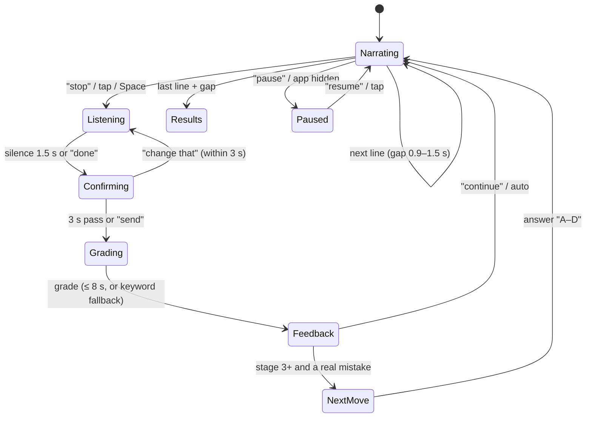

# Voice-first

**Decision D14:** sessions are **voice-first**. The apprentice talks, you say "stop" and explain out loud, and feedback is spoken. **Text mode** is a full alternative you can switch to at any time, for quiet places, noisy rooms or unsupported browsers. The two modes are compared with a built-in A/B test (§6).

Why voice-first:
- It's an active, hands-free loop that works on a walk or a commute.
- It pulls attention to listening for the mistake instead of skimming.
- Speaking the explanation is the self-explanation step that drives learning.

## 1. What "voice-first" means in practice

A whole session must be playable **without looking at or touching the screen** after you press start. The screen still mirrors everything: the transcript, captions and buttons.

| Moment | Voice (default) | Text mode |
|---|---|---|
| Narration | Spoken by the apprentice, with captions | Text appears line by line at reading pace |
| Stopping | Say **"stop"** (hotword), or tap the button, or press Space | Tap or Space |
| Explaining | Speak. It ends after about 1.5 s of silence or when you say "done". The transcript is shown live. | Type, then Enter |
| Fixing a misheard answer | Say **"change that"** within 3 s to re-record, or edit the transcript on screen | — |
| Feedback | Spoken, and shown on screen with identical text | Shown |
| Next-move question | Options read aloud. Say **"A", "B", "C" or "D"** (or "first", "second"…) | Tap |
| Moving on | Say **"continue"**, or it continues automatically after feedback (setting) | Tap |
| Navigation | **"Repeat"** (last line), **"slower" / "faster"**, **"pause"**, **"skip"**, **"end session"** | Buttons |

**Audio cues (earcons):** short sounds for "listening", "got it", "correct", "missed" and "session done", so you know where you are without looking.

## 2. Voice flow inside a card

**Rules:**
- **Barge-in.** Saying "stop" while the apprentice is talking cuts the speech off immediately. The STOP is attributed to the line being spoken, as today.
- **The hotword listens only during narration.** Explanations are recorded only after a STOP. Nothing is recorded at other times.
- **Misheard words are expected.** The grader prompt already treats input as a speech-to-text transcript ("judge what they meant"). The keyword fallback uses stems and synonyms.
- **Silence after STOP.** After 8 s with no speech, the app says "Take your time. Say 'skip' if you're not sure." After 20 s it stays in listening mode with a visible "type instead" button.

## 3. Speech stack

| Part | v1 (free, in the browser) | Later (better quality) | Notes |
|---|---|---|---|
| Speech out (TTS) | Browser `speechSynthesis` (already used) | Pre-rendered neural TTS per card, cached as audio files | Cards are generated before playback, so narration can be rendered **once** and cached, keeping cost per play near zero. Feedback stays live TTS. |
| Speech in (STT) | Browser Web Speech API (already used), with **vad-web** (Silero) for end-of-speech | **On-device Whisper or Moonshine via Transformers.js** for Safari, offline or privacy mode | Web Speech works in Chrome and Edge. Safari support is limited and varies by version, so check on the devices you use. |
| Hotword "stop" | Continuous recognition during narration, matching "stop" or "hold on" | On-device keyword spotting | Must fire within about 300 ms to feel instant; measured as `stopLatencyMs` |
| Voice commands | Small fixed grammar: stop, done, change that, send, repeat, slower, faster, pause, resume, skip, continue, A–D, end session | — | Commands are matched before anything is treated as an explanation |

All of this lives behind one module, `web/speech/`, with the same interface for every provider: `speak`, `listen`, `onHotword`, `cancel`. Swapping a provider doesn't touch any screen.

**Fallback order:** voice → text. If speech recognition isn't available, permission is denied, or 3 recognitions fail in a row, the session switches to text for that session and says why. Each switch is logged as `mode-fallback`.

## 4. Settings

- **Mode:** voice (default) or text. Changeable from any screen, and mid-session.
- **Speaking rate:** 0.8× to 1.4×.
- **Voice:** choice of apprentice voice. A different voice per persona later.
- **Auto-continue after feedback:** on or off.
- **Hotword phrase:** "stop" (default), or another word if "stop" fires by accident.
- **Captions:** on (default) or off.

## 5. Privacy

- **No audio is stored or uploaded.** Only the transcript text is kept and sent to the grader.
- Browser speech recognition may process audio on the browser vendor's servers. Chrome's Web Speech does. Settings says so, and text mode avoids it.
- The microphone is active only while listening, shown by a visible mic indicator.

## 6. The A/B test: voice vs. text

**Purpose:** confirm that voice-first actually helps *you*, rather than assuming it does.

**Design** (within-person, randomized by session):
- **Arms:** each session is randomly assigned **voice** or **text** before it starts. Use a 50/50 split for the test window. Outside the window, voice is the default.
- **Override allowed:** you can always switch modes, because real life gets noisy. Analysis uses the *assigned* mode as the main view (intention-to-treat) and the *actual* mode as a secondary view. The override rate is itself a result: if you switch to text in 60% of voice sessions, that says something.
- **Window:** about 3 weeks, or at least 20 sessions per arm, whichever comes later. It runs alongside the trained vs. held-out learning experiment without interfering, since the two use independent randomizations.
- **Fairness:** the planner gives both arms cards of the same difficulty mix.

**Metrics** (decided now, so results can't be cherry-picked):

| Metric | Question it answers | Primary? |
|---|---|---|
| Session completion rate | Does voice keep you engaged to the end? | **Yes** |
| Catch rate on planted mistakes | Do you notice more when listening? | **Yes** |
| Explanation quality (reasoningScore) | Do you explain better by speaking? | Yes |
| Time-to-STOP after a mistake line | Faster or slower attention? | Secondary |
| Sessions per week while in the window | Habit pull | Secondary |
| Override rate (assigned voice → switched to text) | Is voice practical in your day? | Secondary |
| STT friction: "change that" count, fallback-to-text count | Is recognition good enough? | Health check |
| Later probe accuracy by practice arm | Does how you practised affect what sticks? | Exploratory |

**Decision rule:**
- **Voice stays the default** if it is not worse on both primary metrics.
- **If text wins clearly** (completion and catch rate both better, by at least 10 points), make the default a setting chosen at onboarding.
- **If results are mixed,** keep voice-first and fix what the friction metrics point to.

**Events added:**
- `mode-assigned` (arm);
- `mode-switched` (from, to, reason);
- `mode-fallback` (reason);
- `voice-command` (which command);
- `stt-corrected`.

Each session's `context` carries `mode` and `assignedMode`.

## 7. Build impact

- **F1:** the `web/speech/` module interface; text mode keeps working as today.
- **F2:**
  - voice-first session flow (hotword, barge-in, silence end, "change that", spoken options, voice commands, earcons);
  - captions;
  - mode switch;
  - automatic fallback to text.
- **F3:** the A/B assignment and the analysis on the Progress screen ("Voice vs. text so far"); stop-latency and STT friction metrics.
- **Later:** pre-rendered neural TTS for narration, server-side STT for Safari, per-persona voices.
